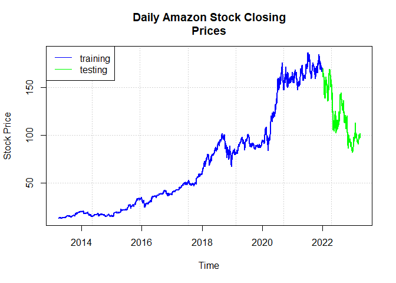
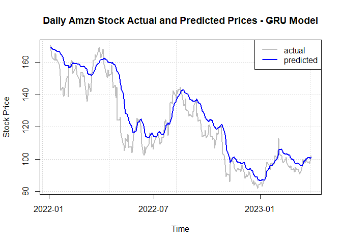

GRU
================

### Loading in Libraries

``` r
# Loading in libraries
library(tidyverse)
```

    ## ── Attaching core tidyverse packages ──────────────────────── tidyverse 2.0.0 ──
    ## ✔ dplyr     1.1.4     ✔ readr     2.1.5
    ## ✔ forcats   1.0.0     ✔ stringr   1.5.1
    ## ✔ ggplot2   3.5.2     ✔ tibble    3.2.1
    ## ✔ lubridate 1.9.4     ✔ tidyr     1.3.1
    ## ✔ purrr     1.0.4     
    ## ── Conflicts ────────────────────────────────────────── tidyverse_conflicts() ──
    ## ✖ dplyr::filter() masks stats::filter()
    ## ✖ dplyr::lag()    masks stats::lag()
    ## ℹ Use the conflicted package (<http://conflicted.r-lib.org/>) to force all conflicts to become errors

*Data Downloaded from YahooFinance*

*Data includes Closing Stock Prices of Amazon from 3/28/13 - 3/30/23 (10
years worth of data)*

### Reading in Data

``` r
# Reading in Data
amzn.data<- read.csv(file="C:/Users/Banri/downloads/AMZN.csv",
header=TRUE, sep=",")
glimpse(amzn.data)
```

    ## Rows: 2,520
    ## Columns: 2
    ## $ Date  <chr> "2013-03-28", "2013-04-01", "2013-04-02", "2013-04-03", "2013-04…
    ## $ Close <dbl> 13.3245, 13.0805, 13.1660, 12.9515, 12.9540, 12.7740, 12.9475, 1…

### Creating variable “Year” for calculations

``` r
# Creating variable Year for calculations
amzn.data$Year <- as.numeric(format(as.Date(amzn.data$Date, format="%Y-%m-%d"),"%Y"))
glimpse(amzn.data)
```

    ## Rows: 2,520
    ## Columns: 3
    ## $ Date  <chr> "2013-03-28", "2013-04-01", "2013-04-02", "2013-04-03", "2013-04…
    ## $ Close <dbl> 13.3245, 13.0805, 13.1660, 12.9515, 12.9540, 12.7740, 12.9475, 1…
    ## $ Year  <dbl> 2013, 2013, 2013, 2013, 2013, 2013, 2013, 2013, 2013, 2013, 2013…

### Separating our data into 80% training and 20% testing for our model

``` r
# Separating our data into 80% training and 20% testing for our model
train.data <- amzn.data[which(amzn.data$Year<2022),1:2]
test.data <- amzn.data[which(amzn.data$Year>=2022),1:2]
glimpse(test.data)
```

    ## Rows: 312
    ## Columns: 2
    ## $ Date  <chr> "2022-01-03", "2022-01-04", "2022-01-05", "2022-01-06", "2022-01…
    ## $ Close <dbl> 170.4045, 167.5220, 164.3570, 163.2540, 162.5540, 161.4860, 165.…

### Plotting our training and testing data for visualization

``` r
# Plotting our training and testing data for visualization
plot(as.POSIXct(amzn.data$Date), amzn.data$Close, main="Daily Amazon Stock Closing
Prices", xlab="Time", ylab="Stock Price", pch="", panel.first=grid())
lines(as.POSIXct(train.data$Date), train.data$Close, lwd=2, col="blue")
lines(as.POSIXct(test.data$Date), test.data$Close, lwd=2, col="green")
legend("topleft", c("training", "testing"), lty=1, col=c("blue","green"))
```

<!-- -->

### Scaling Stock Prices to 0 to 1 for easier neural network machine interpretation

``` r
# Scaling Stock Prices to 0 to 1 for easier neural network machine interpretation
price <- amzn.data$Close
price.scaled <- (price-min(price))/(max(price)-min(price))
glimpse(price.scaled)
```

    ##  num [1:2520] 0.00524 0.00384 0.00433 0.0031 0.00311 ...

### Creating our sliding window

``` r
# Creating our sliding window for time series processing
nsteps <- 60
# Nsteps meaning for each predicted closing stock prices it will look at the previous 60 iterations.
```

### Creating training data matrix

``` r
# Creating training data matrix for each of iterations
train.matrix <- matrix(nrow=nrow(train.data)-nsteps, ncol = nsteps+1)
# For example Closing_Price_61 uses Closing_Price_1 through Closing_Price_60 to predict it's value
```

### Looping through each iteration for training data

``` r
# Looping through each of the iterations
for (i in 1:(nrow(train.data)-nsteps))
  train.matrix[i,] <- price.scaled[i:(i+nsteps)]

# Train x being all the observed values being used to predict
train.x <- array(train.matrix[,-ncol(train.matrix)],dim = c(nrow(train.matrix),nsteps,1))

# Train y being the output
train.y <-train.matrix[,ncol(train.matrix)]
```

### Repeating the same thing for testing data

``` r
# Repeating the steps above for testing data
test.matrix <- matrix(nrow=nrow(test.data), ncol=nsteps+1)

# Loop includes the number of rows from the training matrix
for (i in 1:nrow(test.data))
  test.matrix[i,]<- price.scaled[(i+nrow(train.matrix)):(i+nsteps+nrow(train.matrix))]

# Creating our test x and test y
test.x <- array(test.matrix[,-ncol(test.matrix)],dim=c(nrow(test.matrix),nsteps,1))
test.y <- test.matrix[,ncol(test.matrix)]
```

### Fitting and building our Gated Recurrent Unit model

``` r
library(keras)
GRU.model <- keras_model_sequential()

# Following similar guidlines to our LSTM model
GRU.model %>% layer_gru(input_shape=dim(train.x)[2:3], units=nsteps)
GRU.model %>% layer_dense(units=1, activation="tanh")
GRU.model %>% compile(loss="mean_squared_error")
# Both models use a loss function of MSE
```

### Training and fitting our GRU model

``` r
epochs <- 5

for(i in 1:epochs){
 GRU.model %>% fit(train.x, train.y, batch_size=32, epochs=5)
 GRU.model %>% reset_states() 
}
```

    ## Epoch 1/5
    ## 68/68 - 2s - loss: 0.0181 - 2s/epoch - 34ms/step
    ## Epoch 2/5
    ## 68/68 - 1s - loss: 0.0020 - 888ms/epoch - 13ms/step
    ## Epoch 3/5
    ## 68/68 - 1s - loss: 0.0017 - 868ms/epoch - 13ms/step
    ## Epoch 4/5
    ## 68/68 - 1s - loss: 0.0013 - 865ms/epoch - 13ms/step
    ## Epoch 5/5
    ## 68/68 - 1s - loss: 9.1696e-04 - 866ms/epoch - 13ms/step
    ## Epoch 1/5
    ## 68/68 - 1s - loss: 7.2951e-04 - 865ms/epoch - 13ms/step
    ## Epoch 2/5
    ## 68/68 - 1s - loss: 6.1031e-04 - 917ms/epoch - 13ms/step
    ## Epoch 3/5
    ## 68/68 - 1s - loss: 6.3183e-04 - 863ms/epoch - 13ms/step
    ## Epoch 4/5
    ## 68/68 - 1s - loss: 6.3512e-04 - 863ms/epoch - 13ms/step
    ## Epoch 5/5
    ## 68/68 - 1s - loss: 5.8729e-04 - 869ms/epoch - 13ms/step
    ## Epoch 1/5
    ## 68/68 - 1s - loss: 5.8745e-04 - 866ms/epoch - 13ms/step
    ## Epoch 2/5
    ## 68/68 - 1s - loss: 5.6207e-04 - 869ms/epoch - 13ms/step
    ## Epoch 3/5
    ## 68/68 - 1s - loss: 5.2977e-04 - 871ms/epoch - 13ms/step
    ## Epoch 4/5
    ## 68/68 - 1s - loss: 5.3034e-04 - 875ms/epoch - 13ms/step
    ## Epoch 5/5
    ## 68/68 - 1s - loss: 5.1643e-04 - 867ms/epoch - 13ms/step
    ## Epoch 1/5
    ## 68/68 - 1s - loss: 4.8617e-04 - 865ms/epoch - 13ms/step
    ## Epoch 2/5
    ## 68/68 - 1s - loss: 5.0370e-04 - 863ms/epoch - 13ms/step
    ## Epoch 3/5
    ## 68/68 - 1s - loss: 4.7049e-04 - 866ms/epoch - 13ms/step
    ## Epoch 4/5
    ## 68/68 - 1s - loss: 4.4752e-04 - 862ms/epoch - 13ms/step
    ## Epoch 5/5
    ## 68/68 - 1s - loss: 4.2373e-04 - 865ms/epoch - 13ms/step
    ## Epoch 1/5
    ## 68/68 - 1s - loss: 4.5938e-04 - 863ms/epoch - 13ms/step
    ## Epoch 2/5
    ## 68/68 - 1s - loss: 4.5129e-04 - 859ms/epoch - 13ms/step
    ## Epoch 3/5
    ## 68/68 - 1s - loss: 4.2329e-04 - 859ms/epoch - 13ms/step
    ## Epoch 4/5
    ## 68/68 - 1s - loss: 4.2267e-04 - 859ms/epoch - 13ms/step
    ## Epoch 5/5
    ## 68/68 - 1s - loss: 4.1779e-04 - 864ms/epoch - 13ms/step

### Predicting and re-scaling our testing data

``` r
# Predicting our testing data
pred.y<- GRU.model %>% predict(test.x, batch_size=32)
```

    ## 10/10 - 0s - 289ms/epoch - 29ms/step

``` r
# Re-scaling
test.y.rescaled <- test.y*(max(price)-min(price))+min(price)
pred.y.rescaled<- pred.y*(max(price)-min(price))+min(price)
```

### Computing prediction accuracy

``` r
#computing prediction accuracy
accuracy10<- ifelse(abs(test.y.rescaled-pred.y.rescaled)<0.10*test.y.rescaled,1,0)
accuracy15<- ifelse(abs(test.y.rescaled-pred.y.rescaled)<0.15*test.y.rescaled,1,0)
accuracy20<- ifelse(abs(test.y.rescaled-pred.y.rescaled)<0.20*test.y.rescaled,1,0)
print(paste("accuracy within 10%:", round(mean(accuracy10),4)))
```

    ## [1] "accuracy within 10%: 0.8365"

``` r
print(paste("accuracy within 15%:", round(mean(accuracy15),4)))
```

    ## [1] "accuracy within 15%: 0.9231"

``` r
print(paste("accuracy within 20%:", round(mean(accuracy20),4)))
```

    ## [1] "accuracy within 20%: 0.9647"

### Visualizing our results

``` r
plot(as.POSIXct(test.data$Date), test.y.rescaled, type="l", lwd=2, col="gray", main="Daily Amzn Stock Actual and Predicted Prices - GRU Model", xlab="Time", ylab="Stock Price", panel.first=grid())
lines(as.POSIXct(test.data$Date), pred.y.rescaled, lwd=2, col="blue")
legend("topright", c("actual", "predicted"), lty=1, lwd=2, col=c("gray","blue"))
```

<!-- -->
