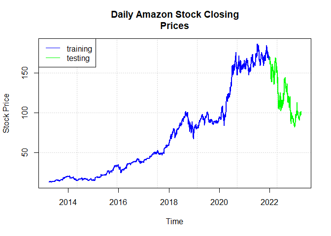
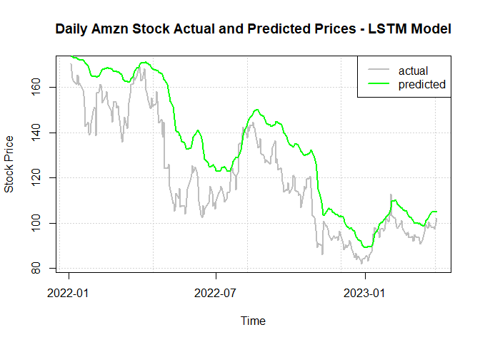

AMZN LSTM
================

### Loading in Libraries

``` r
# Loading in libraries
library(tidyverse)
```

    ## ── Attaching core tidyverse packages ──────────────────────── tidyverse 2.0.0 ──
    ## ✔ dplyr     1.1.4     ✔ readr     2.1.5
    ## ✔ forcats   1.0.0     ✔ stringr   1.5.1
    ## ✔ ggplot2   3.5.2     ✔ tibble    3.2.1
    ## ✔ lubridate 1.9.4     ✔ tidyr     1.3.1
    ## ✔ purrr     1.0.4     
    ## ── Conflicts ────────────────────────────────────────── tidyverse_conflicts() ──
    ## ✖ dplyr::filter() masks stats::filter()
    ## ✖ dplyr::lag()    masks stats::lag()
    ## ℹ Use the conflicted package (<http://conflicted.r-lib.org/>) to force all conflicts to become errors

*Data Downloaded from YahooFinance*

*Data includes Closing Stock Prices of Amazon from 3/28/13 - 3/30/23 (10
years worth of data)*

### Reading in Data

``` r
# Reading in Data
amzn.data<- read.csv(file="C:/Users/Banri/downloads/AMZN.csv",
header=TRUE, sep=",")
glimpse(amzn.data)
```

    ## Rows: 2,520
    ## Columns: 2
    ## $ Date  <chr> "2013-03-28", "2013-04-01", "2013-04-02", "2013-04-03", "2013-04…
    ## $ Close <dbl> 13.3245, 13.0805, 13.1660, 12.9515, 12.9540, 12.7740, 12.9475, 1…

### Creating variable “Year” for calculations

``` r
# Creating variable Year for calculations
amzn.data$Year <- as.numeric(format(as.Date(amzn.data$Date, format="%Y-%m-%d"),"%Y"))
glimpse(amzn.data)
```

    ## Rows: 2,520
    ## Columns: 3
    ## $ Date  <chr> "2013-03-28", "2013-04-01", "2013-04-02", "2013-04-03", "2013-04…
    ## $ Close <dbl> 13.3245, 13.0805, 13.1660, 12.9515, 12.9540, 12.7740, 12.9475, 1…
    ## $ Year  <dbl> 2013, 2013, 2013, 2013, 2013, 2013, 2013, 2013, 2013, 2013, 2013…

### Separating our data into 80% training and 20% testing for our model

``` r
# Separating our data into 80% training and 20% testing for our model
train.data <- amzn.data[which(amzn.data$Year<2022),1:2]
test.data <- amzn.data[which(amzn.data$Year>=2022),1:2]
glimpse(test.data)
```

    ## Rows: 312
    ## Columns: 2
    ## $ Date  <chr> "2022-01-03", "2022-01-04", "2022-01-05", "2022-01-06", "2022-01…
    ## $ Close <dbl> 170.4045, 167.5220, 164.3570, 163.2540, 162.5540, 161.4860, 165.…

### Plotting our training and testing data for visualization

``` r
# Plotting our training and testing data for visualization
plot(as.POSIXct(amzn.data$Date), amzn.data$Close, main="Daily Amazon Stock Closing
Prices", xlab="Time", ylab="Stock Price", pch="", panel.first=grid())
lines(as.POSIXct(train.data$Date), train.data$Close, lwd=2, col="blue")
lines(as.POSIXct(test.data$Date), test.data$Close, lwd=2, col="green")
legend("topleft", c("training", "testing"), lty=1, col=c("blue","green"))
```

<!-- -->

### Scaling Stock Prices to 0 to 1 for easier neural network machine interpretation

``` r
# Scaling Stock Prices to 0 to 1 for easier neural network machine interpretation
price <- amzn.data$Close
price.scaled <- (price-min(price))/(max(price)-min(price))
glimpse(price.scaled)
```

    ##  num [1:2520] 0.00524 0.00384 0.00433 0.0031 0.00311 ...

### Creating our sliding window

``` r
# Creating our sliding window for time series processing
nsteps <- 60
# Nsteps meaning for each predicted closing stock prices it will look at the previous 60 iterations.
```

### Creating training data matrix

``` r
# Creating training data matrix for each of iterations
train.matrix <- matrix(nrow=nrow(train.data)-nsteps, ncol = nsteps+1)
# For example Closing_Price_61 uses Closing_Price_1 through Closing_Price_60 to predict it's value
```

### Looping through each iteration for training data

``` r
# Looping through each of the iterations
for (i in 1:(nrow(train.data)-nsteps))
  train.matrix[i,] <- price.scaled[i:(i+nsteps)]

# Train x being all the observed values being used to predict
train.x <- array(train.matrix[,-ncol(train.matrix)],dim = c(nrow(train.matrix),nsteps,1))

# Train y being the output
train.y <-train.matrix[,ncol(train.matrix)]
```

### Repeating the same thing for testing data

``` r
# Repeating the steps above for testing data
test.matrix <- matrix(nrow=nrow(test.data), ncol=nsteps+1)

# Loop includes the number of rows from the training matrix
for (i in 1:nrow(test.data))
  test.matrix[i,]<- price.scaled[(i+nrow(train.matrix)):(i+nsteps+nrow(train.matrix))]

# Creating our test x and test y
test.x <- array(test.matrix[,-ncol(test.matrix)],dim=c(nrow(test.matrix),nsteps,1))
test.y <- test.matrix[,ncol(test.matrix)]
```

### Fitting and building our Long Short-Term Memory model

``` r
# Fitting our Long Short-Term Memory model
# LSTM looks for big patterns over time as well as recent events. LSTM manages it's memory by having 3 gates.
# Forget Gate = Should it forget something from the past?
# Input Gate = Should it store this new information?
# Output Gate = Should I use this memory to make a decision now?
# These gates are layered over and over to form a neural network
library(keras)
LSTM.model <- keras_model_sequential()
# Input shape is the vector of the dimensions
LSTM.model %>% layer_lstm(input_shape=dim(train.x)[2:3], units=nsteps)

# Layer dense being another layer of a neural network to our output, using the activation funcion of tanh. Units here will be the dimensionality of our space.
LSTM.model %>% layer_dense(units=1, activation="tanh")

# We use MSE as our loss function as it works well with our neural network and is easy to optimize
LSTM.model %>% compile(loss="mean_squared_error")
```

### Training our LSTM model

``` r
# Training the LSTM Model

# Epochs being the number of passes the model goes through. 
epochs<- 5

# Looping the model with 32 samples and 5 passes through the entire data, reset ensures no unnecessary information is saved.
for(i in 1:epochs){
 LSTM.model %>% fit(train.x, train.y, batch_size=32, epochs=5)
 LSTM.model %>% reset_states() 
}
```

    ## Epoch 1/5
    ## 68/68 - 2s - loss: 0.0075 - 2s/epoch - 32ms/step
    ## Epoch 2/5
    ## 68/68 - 1s - loss: 0.0014 - 862ms/epoch - 13ms/step
    ## Epoch 3/5
    ## 68/68 - 1s - loss: 0.0011 - 835ms/epoch - 12ms/step
    ## Epoch 4/5
    ## 68/68 - 1s - loss: 8.3717e-04 - 848ms/epoch - 12ms/step
    ## Epoch 5/5
    ## 68/68 - 1s - loss: 8.3383e-04 - 834ms/epoch - 12ms/step
    ## Epoch 1/5
    ## 68/68 - 1s - loss: 7.1372e-04 - 878ms/epoch - 13ms/step
    ## Epoch 2/5
    ## 68/68 - 1s - loss: 7.2738e-04 - 953ms/epoch - 14ms/step
    ## Epoch 3/5
    ## 68/68 - 1s - loss: 6.6007e-04 - 907ms/epoch - 13ms/step
    ## Epoch 4/5
    ## 68/68 - 1s - loss: 6.2186e-04 - 922ms/epoch - 14ms/step
    ## Epoch 5/5
    ## 68/68 - 1s - loss: 5.9843e-04 - 951ms/epoch - 14ms/step
    ## Epoch 1/5
    ## 68/68 - 1s - loss: 5.7096e-04 - 1s/epoch - 18ms/step
    ## Epoch 2/5
    ## 68/68 - 1s - loss: 5.0556e-04 - 881ms/epoch - 13ms/step
    ## Epoch 3/5
    ## 68/68 - 1s - loss: 4.6879e-04 - 868ms/epoch - 13ms/step
    ## Epoch 4/5
    ## 68/68 - 1s - loss: 4.7946e-04 - 877ms/epoch - 13ms/step
    ## Epoch 5/5
    ## 68/68 - 1s - loss: 4.9303e-04 - 909ms/epoch - 13ms/step
    ## Epoch 1/5
    ## 68/68 - 1s - loss: 4.2929e-04 - 923ms/epoch - 14ms/step
    ## Epoch 2/5
    ## 68/68 - 1s - loss: 4.5468e-04 - 868ms/epoch - 13ms/step
    ## Epoch 3/5
    ## 68/68 - 1s - loss: 4.2170e-04 - 825ms/epoch - 12ms/step
    ## Epoch 4/5
    ## 68/68 - 1s - loss: 3.9137e-04 - 846ms/epoch - 12ms/step
    ## Epoch 5/5
    ## 68/68 - 1s - loss: 3.9641e-04 - 833ms/epoch - 12ms/step
    ## Epoch 1/5
    ## 68/68 - 1s - loss: 4.1526e-04 - 851ms/epoch - 13ms/step
    ## Epoch 2/5
    ## 68/68 - 1s - loss: 3.8824e-04 - 859ms/epoch - 13ms/step
    ## Epoch 3/5
    ## 68/68 - 1s - loss: 3.6273e-04 - 864ms/epoch - 13ms/step
    ## Epoch 4/5
    ## 68/68 - 1s - loss: 3.7398e-04 - 890ms/epoch - 13ms/step
    ## Epoch 5/5
    ## 68/68 - 1s - loss: 3.6623e-04 - 914ms/epoch - 13ms/step

``` r
# (Choosing the number of epochs can be decided on training loss and validation loss. Balancing loss functions help prevent overfitting of the model)
```

### Predicting our test data and re-scaling

``` r
# Predicting our test data
pred.y <- LSTM.model %>% predict(test.x, batch_size=32)
```

    ## 10/10 - 0s - 331ms/epoch - 33ms/step

``` r
# Re-scaling the test and predicted values back to original prices
test.y.rescaled <- test.y*(max(price)-min(price))+min(price)
pred.y.rescaled <- pred.y*(max(price)-min(price))+min(price)
```

### Computing model accuracy

``` r
# Computing Model Accuracy with 10%, 15%, 20%
accuracy10<- ifelse(abs(test.y.rescaled-pred.y.rescaled)<0.10*test.y.rescaled,1,0)
accuracy15<- ifelse(abs(test.y.rescaled-pred.y.rescaled)<0.15*test.y.rescaled,1,0)
accuracy20<- ifelse(abs(test.y.rescaled-pred.y.rescaled)<0.20*test.y.rescaled,1,0)
print(paste("accuracy within 10%:", round(mean(accuracy10),4)))
```

    ## [1] "accuracy within 10%: 0.891"

``` r
print(paste("accuracy within 15%:", round(mean(accuracy15),4)))
```

    ## [1] "accuracy within 15%: 0.9583"

``` r
print(paste("accuracy within 20%:", round(mean(accuracy20),4)))
```

    ## [1] "accuracy within 20%: 0.9936"

### Visiualizing our actual and predicted values

``` r
# Visualizating our actual and predicted values for our testing data
plot(as.POSIXct(test.data$Date), test.y.rescaled, type="l", lwd=2, col="gray", main="Daily Amzn Stock Actual and Predicted Prices - LSTM Model", xlab="Time", ylab="Stock Price", panel.first=grid())
lines(as.POSIXct(test.data$Date), pred.y.rescaled, lwd=2, col="green")
legend("topright", c("actual", "predicted"), lty=1, lwd=2, col=c("gray","green"))
```

<!-- -->

### Code for showcasing whether or not the model was able to predict accurate increases or decreases in stock price for options

``` r
# Code for showing whether or not the model was able to predict accurate higher or lower prices.
actual.direction <- diff(test.y.rescaled) > 0  # TRUE if price went up
predicted.direction <- diff(pred.y.rescaled) > 0
direction.correct <- actual.direction == predicted.direction
directional.accuracy <- mean(direction.correct)
directional.accuracy
```

    ## [1] 0.5176849
